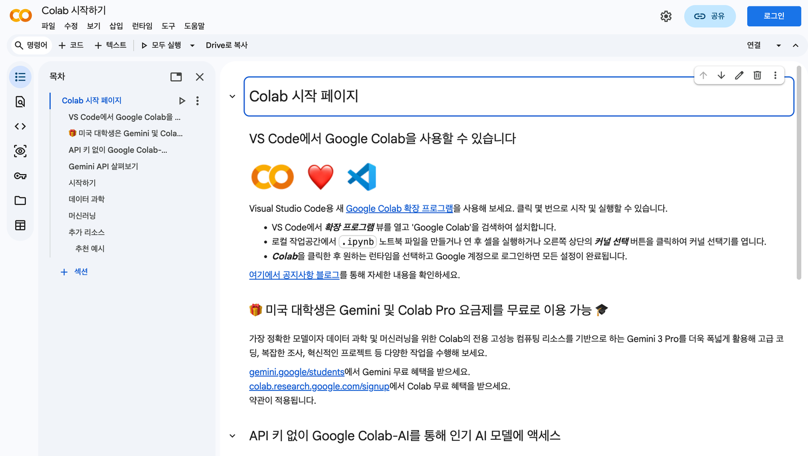
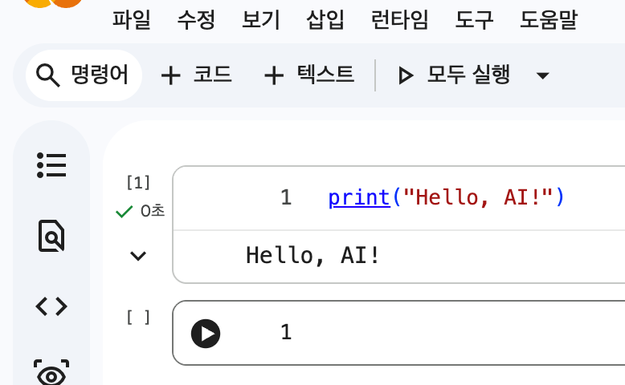
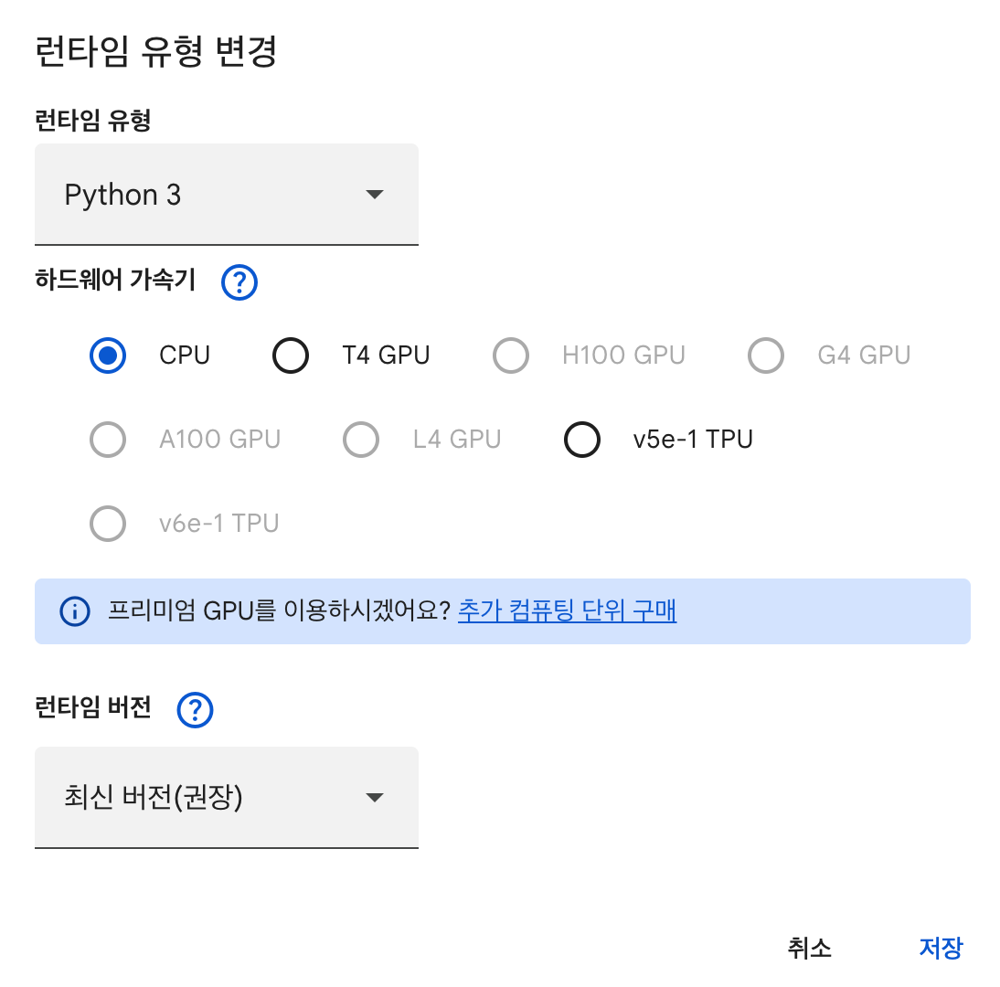
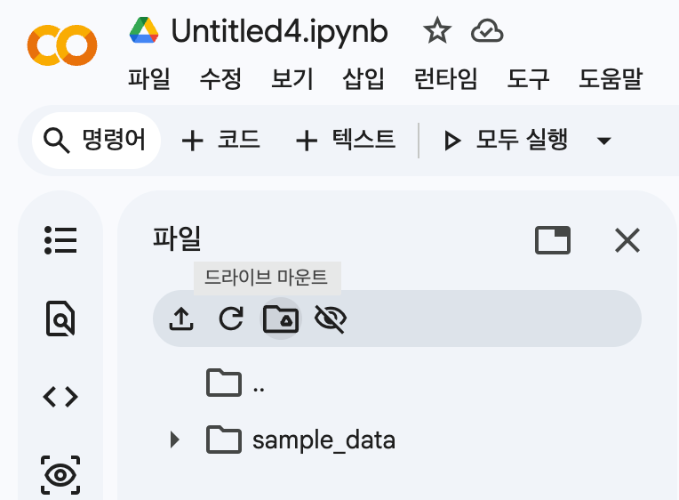
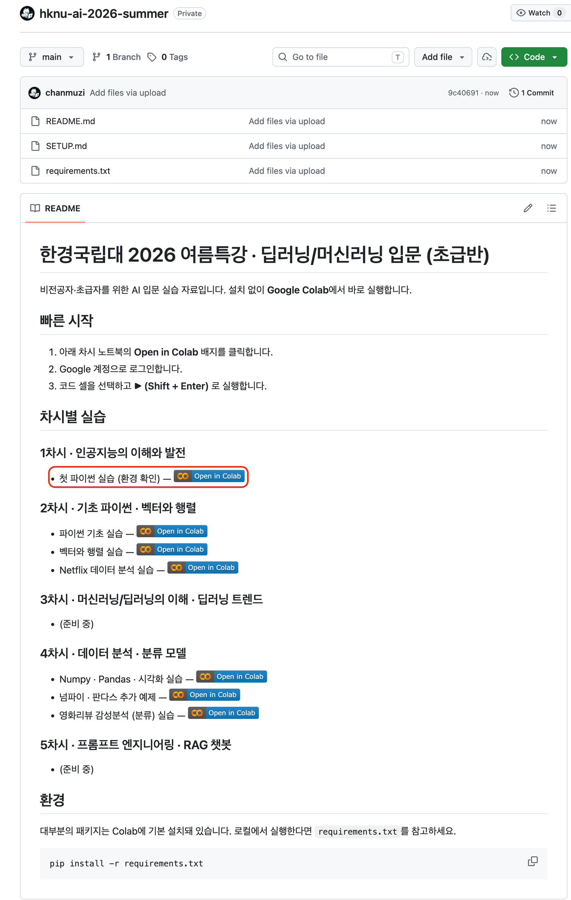
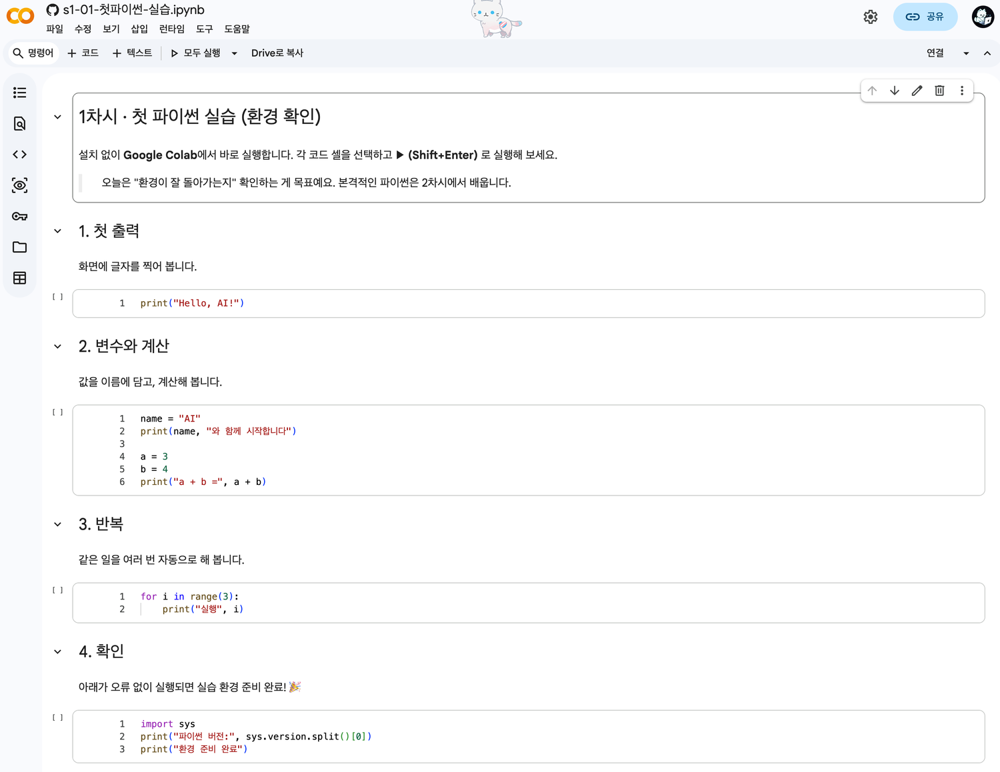

# 실습 환경 세팅 가이드

설치 없이 **Google Colab**에서 바로 실행합니다. 1차시 시작 전에 아래 순서대로 한 번만 준비하면, 이후 모든 차시(2~5차시) 노트북을 같은 방법으로 엽니다.
> 이미지는 저장소 `images/` 폴더에 캡쳐를 넣으면 아래에 표시됩니다.

## 1. Google 계정 준비
Colab을 쓰려면 Google 계정이 필요합니다. **이미 있으면 그대로** 쓰고, 없으면 [가입](https://accounts.google.com/signup)하세요.


> GitHub 계정은 **필수가 아닙니다.** 공개 저장소의 노트북은 로그인 없이 Colab으로 열 수 있어요. (직접 수정본을 저장·fork 할 때만 필요)

## 2. Colab 접속 & 새 노트
1. <https://colab.research.google.com> 접속
2. **새 노트** 만들기



## 3. 첫 코드 실행
코드 셀에 입력하고 **▶ (Shift + Enter)** 로 실행:
```python
print("Hello, AI!")
```



## 4. 환경 설정
### 4-1. 런타임 유형 (GPU)
상단 **런타임 → 런타임 유형 변경 → 하드웨어 가속기에서 GPU** 선택. (딥러닝 차시에서 사용)



### 4-2. 구글 드라이브 마운트
좌측 **폴더 아이콘 → 드라이브 마운트**. 작업한 노트와 데이터를 저장·불러올 수 있습니다.



## 5. GitHub에서 실습 파일 열기
1. 강의 저장소 접속: <https://github.com/chanmuzi/hknu-ai-2026-summer>
2. README의 **Open in Colab** 배지를 클릭하면 해당 노트북이 Colab에서 열립니다.



## 6. 첫 실습 노트 실행
`session-1-ai-intro/s1-01-첫파이썬-실습.ipynb` 가 Colab에서 열리면 위에서부터 **▶ 실행** → "환경 준비 완료"가 나오면 끝!



## 7. 차시별 데이터·키 준비
대부분의 노트북은 추가 준비 없이 바로 실행됩니다. 아래 차시만 별도 준비물이 있습니다.

### 2차시 · Hugging Face 모델 체험
- OpenAI API 키 **불필요**. 공개 모델을 그대로 불러옵니다.
- 일부 모델은 **GPU 권장** — 상단 **런타임 → 런타임 유형 변경 → GPU**.

### 4차시 · 데이터 분석과 머신러닝
- **Netflix 분석(s4-02)**: `session-4-data-analysis/data/netflix_titles.csv` 를 사용합니다. 노트북 첫 셀이 강의 저장소를 통째로 내려받아(`git clone`) 자동으로 불러오므로, 별도 업로드가 필요 없습니다.
  ```bash
  !git clone https://github.com/chanmuzi/hknu-ai-2026-summer.git
  ```
- **집값 예측(s4-04)**: Kaggle *House Prices* 데이터가 필요합니다.
  - [대회 데이터 페이지](https://www.kaggle.com/competitions/house-prices-advanced-regression-techniques/data)에서 **`train.csv`·`test.csv`** 를 내려받습니다.
  - Colab 왼쪽 **📁(파일) 패널**에 두 파일을 끌어다 올리면 `pd.read_csv('train.csv')` 가 그대로 동작합니다.

### 5차시 · 딥러닝과 RAG 챗봇
- **프롬프트·RAG·멀티에이전트(s5-01·02·04)**: **OpenAI API 키**가 필요합니다. 노트북 실행 중 나타나는 입력 창에 키를 붙여 넣으세요(코드에 직접 적지 않습니다).
- **BERT 파인튜닝(s5-03)**: API 키 없이 동작하지만 학습 속도를 위해 **GPU 권장** — 런타임을 GPU 로 바꾸세요.
